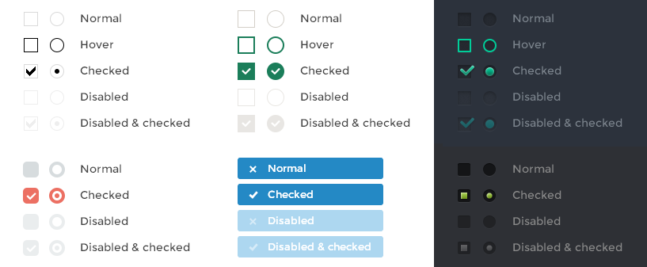

# 组件名称一级标题

这里是文档简介。这里是文档简介。这里是文档简介。这里是文档简介。这里是文档简介。

Englist introduction,Englist introduction,Englist introduction,Englist introduction,Englist introduction.

## 二级标题

二级内容简介。二级内容简介。二级内容简介。二级内容简介。二级内容简介。二级内容简介。二级内容简介。二级内容简介。二级内容简介。二级内容简介。二级内容简介。二级内容简介。

列表样式一标题说明：

- 列表一文字，列表一文字，列表一文字，列表一文字

  列表一补充说明。 列表一补充说明。 列表一补充说明。 列表一补充说明。 列表一补充说明。

- 列表一文字，列表一文字，列表一文字，列表一文字

   列表一补充说明。 列表一补充说明。 列表一补充说明。 列表一补充说明。 列表一补充说明。

列表样式二标题说明：

- 列表二文字，列表二文字，列表二文字，列表二文字，列表二文字

  - 列表内层说明。列表内层说明。列表内层说明。列表内层说明。列表内层说明。列表内层说明。
 
- 列表二文字，列表二文字，列表二文字，列表二文字，列表二文字

  - 列表内层说明。列表内层说明。列表内层说明。列表内层说明。列表内层说明。列表内层说明。

开发 table 示例：



   `*table.html*`
   
   ```html
    <table id="ajax-table" class="table table-bordered table-hover">
        <thead>
            <tr>
                <td>序号</td>
                <td>标题</td>
                <td>链接</td>
            </tr>
        </thead>
    </table>				
   ```

   `*check.js*`

   ```js
    /*
    *
    * 这是一个 reducer，形式为 (state, action) => state 的纯函数。
    *
    * state 的形式取决于你，可以是基本类型、数组、对象、
    *
    * 下面例子使用 `switch` 语句和字符串来做判断，但你可以写帮助类(helper)
    */
    function counter(state = 0, action) {
        switch (action.type) {
        case 'INCREMENT':
            return state + 1;
        case 'DECREMENT':
            return state - 1;
        default:
            return state;
        }
    }
    
    // 可以手动订阅更新，也可以事件绑定到视图层。
    store.subscribe(() =>
    console.log(store.getState())
    );

   ```  
该示例简要说明。该示例简要说明。该示例简要说明。该示例简要说明。该示例简要说明。该示例简要说明。

表格说明。表格说明。表格说明。

事件名称 | 使用时机
-------- | ------
ifClicked | 用户点击了自定义的输入框或与其相关联的label
ifChanged | 输入框的 checked 或 disabled 状态改变了
ifChecked | 输入框的状态变为 checked
ifUnchecked | checked 状态被移除

> 补充说明。补充说明。补充说明。补充说明。补充说明。补充说明。补充说明。补充说明。补充说明。

